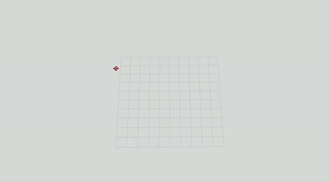

# MADAEP
**M**ulti-**A**gent **D**ynamic **A**utonomous **E**xploration **P**lanner is an exploration planner made for multi-agent systems in dynamic environments, it uses state estimation of dynamic obstacles in order to minimize collisions, Voronoi functionality for spatial distribution, Gaussian fields in order to avoid overlapping of agents and more. The system itself is decentralized, and builds upon the single-agent exploration planner [DAEP](https://github.com/LudvigWiden/daeplanner), with the motion planner and mapping system from [RACER](https://github.com/SYSU-STAR/RACER).
 
  

*Complete exploration of a small world using 2 agents, 2x speed.*

*Part of exploration on medium-large world using 6 agents, 2x speed.*

## System Recommendations
The system was tested on a computer with:

- AMD Ryzen 9 5900X 12-core processor 
- NVIDIA GeForce RTX 3090 Ti
- Ubuntu 22.04.2 operating system. 
- [Rootless docker mode](https://docs.docker.com/engine/security/rootless/).

## Installation and usage
There are several ways to run the simulation and the planners, as of now there are three planners available within the simulation. MADAEP, DAEP and RACER, all of which run with the same motion planner and mapping. The system is made to run in Docker containers and is similar to the system used for DAEP, for information about how to setup Docker see [here](https://docs.docker.com/engine/security/rootless/) or [here](https://gitlab.liu.se/ai-academy/ros-base) for AI Academy, more information can also be found on DAEPs [wiki](https://github.com/LudvigWiden/daeplanner/wiki). 

1) Clone this repository.
2) Within each planners folder, /daep/, /madaep/, /racer/, clone the [model repository](https://github.com/osrf/gazebo_models) needed for Gazebo models.
3) Build the Docker images by standing in the root folder of the repository and running **./dev_env.sh build madaep**, for each planner
4) Enter each container using **./dev_env.sh start madaep**, and go to the catkin_ws folder, and build using **catkin build**, if an error is thrown, either retry or build the aeplanner package first by running **catkin build aeplanner**, and then retry building all packages
5) After step 1-5, the planners and simulation environments can be run, using for example the files *experiments.yaml* and *run_experiments.py* within the root folder. In order to use the standard settings and scenario structure, run **python3 run_experiments.py** within the root folder, and the system should start automatically, and changing worlds, planners, agent count, obstacle count etc. can be done in *experiments.yaml*.

## Credits
This work has been developed by Lukas Moe with the help and support of the members at the [Division of Artificial Intelligence and Integrated Computer Systems](https://liu.se/en/organisation/liu/ida/aiics) at [Linköping University](https://liu.se/en).

## Contact
For questions and remarks please contact the developers.

